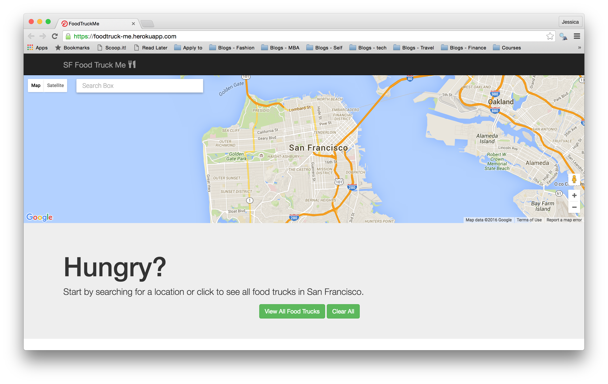

# Food Truck Me

This web app was implemented for Uber's full-stack coding challenge [here](https://github.com/uber/coding-challenge-tools/blob/master/coding_challenge.md#food-trucks).

It displays location data about food trucks in San Francisco via markers on a Google map. The user can search for a specific location on the map or view all food trucks in the area. By clicking on a specific location marker, the user can see specific information about the food truck, including its name, address, available food items, hours, location description, and a link to Google map directions based on the user's current address.

## Architecture
This application uses Rails and Postgresql to implement a simple back-end that can be queried for a JSON object of food truck data. I import this food truck data into my application from [SF Gov Data](https://data.sfgov.org/Economy-and-Community/Mobile-Food-Facility-Permit/rqzj-sfat) by using a Rake task and creating and storing `FoodTruck` records. The frontend is a single-page Backbone application that has a model and collection for food trucks, as well as a router. There are two views: the `MapView` where the Google map is displayed and the `FoodTrucksFilter` which has two buttons to view all food trucks and to clear all food trucks. If there are future filters added, it would probably go in this view. 

##Demo
Check out the app [here](https://foodtruck-me.herokuapp.com/).

##Software used
* Ruby on Rails: moderate experience
* Backbone: very little experience
* Google Maps Javascript API: some experience
* Twitter Bootstrap
* Faraday
* Multijson

##Improvements
* Add testing.
* Add a filter to search food trucks by type of food.
